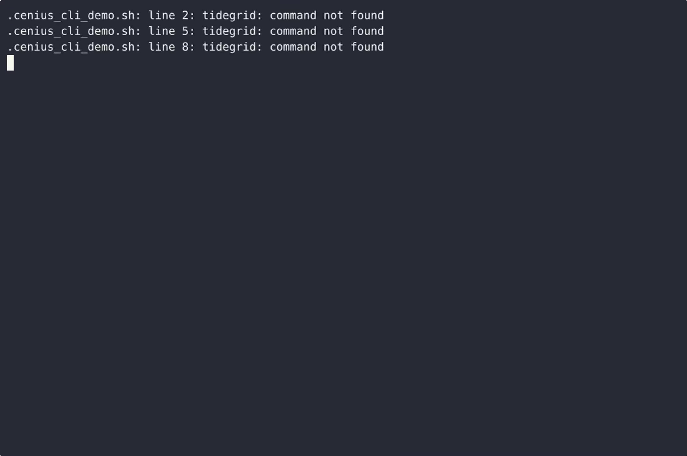

# Tidegrid — complete Full-stack app command-line tool example app

A Full-stack app command-line tool, open-source and ready to self-host: that's **Tidegrid**. Tidegrid is a single-file, standard-library-only Python command-line tool that stores tidal harmonic constants in one JSON file in the working directory, lets you add, edit, list and remove those constants through sub…. Tidegrid ships complete — source, design assets, seed data — under the Apache-2.0 license; no cloud account needed. [Remix Tidegrid on cenius.ai](https://cenius.ai/marketplace/p/tidegrid?ref=gh&utm_campaign=tidegrid-webapp) for a custom build.


[](LICENSE)  [](https://cenius.ai)

[](https://cenius.ai/marketplace/p/tidegrid?ref=gh&utm_campaign=tidegrid-webapp)

> **▶ [Open & edit in cenius.ai](https://cenius.ai/marketplace/p/tidegrid?ref=gh&utm_campaign=tidegrid-webapp)** — one click to an editable workspace: describe changes in plain English, get an instant preview, one-click deploy and host. Modifications made on the platform come with full rebrand & relicense rights.

_Local clone? See [Quick start](#quick-start) below. cenius.ai is the zero-setup path._

## Demo


📽 **[Demo video on cenius.ai](https://cenius.ai/marketplace/p/tidegrid?ref=gh&utm_campaign=tidegrid-webapp)** — the complete run-through · [MP4](.github/media/demo.mp4)

## Screenshots



## Features

- Station file store (init, show, validate, atomic save)
- Harmonic constant editor
- High/low water prediction for a date
- Exportable tide table to stdout
- Built-in constituent catalog

## Quick start

```bash
./install.sh   # installs dependencies + seeds demo data
```

See [`INSTALL.md`](INSTALL.md) for full setup and usage instructions.

## Usage guide

Every command takes `--file PATH` (default `station.json`) except `init`, which creates
that file, and `constituents`, which reads only the built-in catalog. All commands run and
exit; none of them wait for input.

### 1. Scaffold a station

```console
$ python3 tidegrid.py init --file station.json --name 'Port Haven' --datum MLLW --z0 2.35 --units m --tz-offset -300
created station.json
name             Port Haven
datum            MLLW
z0_m             2.35
units            m
timezone_offset  -05:00 (-300 minutes)

constituents      none yet - add one with: tidegrid add M2 --file station.json --amplitude 0.62 --phase 120
```

`--z0` is the chart datum offset Z0: it is added to every predicted height, so a station
whose mean level sits 2.35 m above chart datum says `--z0 2.35`. `init` refuses to touch an
existing file unless you pass `--force`, and `--force` rewrites a fresh scaffold, so keep a
copy if you are about to replace hand-tuned constants.

### 2. Add the harmonic constants

_Full guide: [`USAGE.md`](USAGE.md)_

## Architecture

A self-contained Full-stack app project (25 files): top-level directories include `demo/`, `examples/`, `tests/`. Starting up is just `./install.sh`: it installs what is needed and pre-fills the database so you have data to work with straight away. Step-by-step setup guide: [`INSTALL.md`](INSTALL.md).

## FAQ

### How do I self-host Tidegrid?

`git clone` + `./install.sh` gets you a running instance — the install script provisions dependencies and demo data. Full steps live in [`INSTALL.md`](INSTALL.md); nothing external is needed to try it.

### What license does Tidegrid use?

Yes — it ships under the Apache-2.0 license, which permits commercial use, modification and redistribution. The full text is in [LICENSE](LICENSE).

### How can I customize Tidegrid without editing code?

Yes — [load it on cenius.ai](https://cenius.ai/marketplace/p/tidegrid?ref=gh&utm_campaign=tidegrid-webapp), describe the change in plain English, and you get back a fresh build with your modification applied.

### Which framework or language does Tidegrid use?

Tidegrid runs on Full-stack app. This repo holds the full production source: you can inspect every part of it before deploying. Highlights include harmonic constant editor.

### How do I make Tidegrid my own brand?

Yes. You can edit the source directly under the MIT license, or [remix it on cenius.ai](https://cenius.ai/marketplace/p/tidegrid?ref=gh&utm_campaign=tidegrid-webapp) — the platform route grants full rebrand and relicense rights over your derivative.

## License & rebranding

Released under the [Apache License 2.0](LICENSE) (© 2026 Cenius AI) — free for personal and commercial use. The Cenius name/logo are trademarks (see NOTICE).

**Need a customized version?** [Remix this app on cenius.ai](https://cenius.ai/marketplace/p/tidegrid?ref=gh&utm_campaign=tidegrid-webapp) — modifications made on the platform come with **full rebrand & relicense rights** over your derivative.

## Built with cenius.ai

This entire application — code, design, seeded demo data — was generated on **[cenius.ai](https://cenius.ai)** from a plain-English description.

- 🚀 [Build your own app on cenius.ai](https://cenius.ai)
- 🎛️ [Remix Tidegrid on the marketplace](https://cenius.ai/marketplace/p/tidegrid?ref=gh&utm_campaign=tidegrid-webapp) — open it in a workspace, prompt for changes, and ship your own version.

More open-source apps: [the Cenius-ai catalog](https://github.com/Cenius-ai) · [showcase index](https://github.com/Cenius-ai/showcase)
